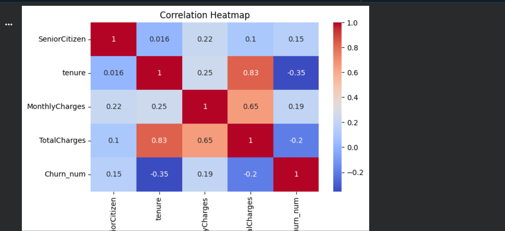

# Customer Churn Analysis using Python

## Objective
The objective of this project is to analyze customer churn using the Telco Customer Churn dataset. This analysis aims to identify the customer characteristics and service-related factors associated with churn, helping businesses improve customer retention through data-driven insights.

## Dataset
**Source:** [Telco Customer Churn Dataset (Kaggle)](https://www.kaggle.com/datasets/blastchar/telco-customer-churn)

The dataset contains information about:
- Customer demographics (Gender, Senior Citizen, Partner, Dependents)
- Internet services
- Phone services
- Contract type
- Monthly charges
- Total charges
- Payment method
- Customer churn status

**Total Records:** 7043
**Target Variable:** Churn (Yes/No)

## Tools & Libraries Used
- Python
- Pandas
- NumPy
- Matplotlib
- Seaborn

## Project Workflow
1. Data Understanding – Explored the dataset structure, data types, and summary statistics.
2. Data Cleaning – Handled missing values, checked for duplicates, converted `TotalCharges` to numeric format, and removed incomplete records.
3. Exploratory Data Analysis (EDA) – Analyzed customer churn using visualizations to identify important trends and patterns.
4. Key Insights – Summarized the major findings from the analysis.
5. Business Recommendations – Suggested strategies to improve customer retention based on the analysis.

## Correlation Heatmap


## Key Insights
1. About one-fourth of the customers have churned, while most customers stayed with the company.
2. Customers with month-to-month contracts are more likely to leave than customers with one-year or two-year contracts.
3. Customers with shorter tenure have a higher chance of churning, while customers with longer tenure are more likely to stay.
4. Customers using Fiber Optic internet service have a higher churn rate compared to customers using other internet services.
5. Customers who use Electronic Check as their payment method have a higher churn rate than customers using other payment methods.
6. Customers with higher monthly charges are more likely to churn.
7. Senior citizens and customers without dependents show slightly higher churn rates than other customer groups.

## Business Recommendations
1. Encourage customers to choose one-year or two-year contracts by offering discounts or special benefits.
2. Focus on retaining new customers by providing better support during their first few months.
3. Review the pricing and service quality of Fiber Optic internet plans to improve customer satisfaction.
4. Encourage customers to use automatic payment methods instead of Electronic Check by offering small incentives.
5. Identify customers with high monthly charges and provide personalized offers or discounts to reduce churn.
6. Reward long-term customers with loyalty programs to encourage them to stay with the company.
7. Focus on senior citizens and customers without dependents by offering better support and personalized plans to improve customer retention.

## How to Run
1. Clone this repository
   ```
   git clone https://github.com/bhavyanagpal24/Customer-Churn-Analysis.git
   ```
2. Open `Customer_Churn_Analysis.ipynb` in Jupyter Notebook, JupyterLab, or Google Colab
3. Make sure `Telco_customer_churn.csv` is in the same folder as the notebook
4. Run all cells from top to bottom

## Repository Contents
- `Customer_Churn_Analysis.ipynb` — full analysis notebook
- `Telco_customer_churn.csv` — dataset used for analysis
- `correlation_heatmap.png` — heatmap image shown in this README
- `README.md` — project overview

## Author
**Bhavya Nagpal**
[GitHub](https://github.com/bhavyanagpal24)
